# 개요 

블록체인 개발을 처음 입문하시는 분들을 위한 튜토리얼
개발을 위한 환경설정부터 블록체인 핵심 언어인 solidy의 기본 문법, metamask 생성,
testnet ganache 사용법, 그리고 front-end 언어인 react를 이용해서 블록체인 개발의 전 과정을 실습하며
입문자를 도와주는 학습 프로젝트이다. 

이번 프로젝트에서는 League Of Legend의 한국 대회인 LCK 경기 일정에 따라 사용자가 토큰을 배팅하면 
승패 결과에 따라 정산해주는 애플리케이션 및 웹을 개발해볼 것이다. 

본 과정은 초보자들이 가장 어렵고 까다로워하는 개발 환경 설정과 solidity를 중점적으로 다룰 것이다. 

## vscode


vscode는 프로그래밍에서 기본적이며 대표적인 문서 편집기이다. 
해당 프로젝트에서 대부분의 코딩 및 명령어 실행은 해당 편집기를 통해 이루어진다.

https://code.visualstudio.com/

위의 공식 사이트를 방문해 본인 사양에 맞는 프로그램을 설치해줍니다. 

## wsl 
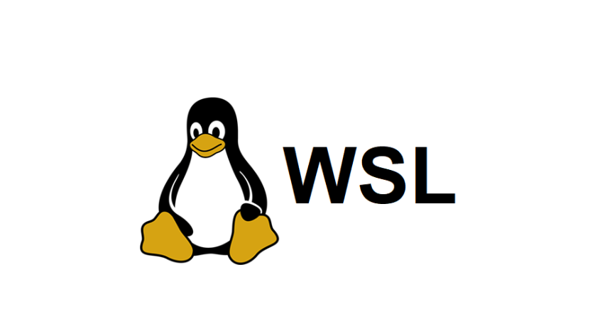

Window, Linux, Mac은 대표적인 운영체제이나, 프로그래밍과 코딩에 익숙치 않은 대부분의 사람들은 window를 사용한다. 프로그래밍, 특히 window에서 블록체인을 개발할 때에는 여러 호환성이나 종속성 문제가 발생하므로 WSL를 설치하여 사용하기를 권장한다.  

WSL이란 window sub-system for linux의 약자로 윈도우의 가상화 기술을 통해 윈도우에서 리눅스의 명령어 및 기능를 실행 할 수 있게 해준다. 이를 통해 윈도우 개발 환경에서 수월하게 개발환경을 세팅할 수 있다. 

https://gaesae.com/161

위의 게시글의 전 과정을 진행하며 WSL를 설치해준다. 

wsl 설치과정 48.에서 versbose가 아닌 verbose이다. 

    wsl --list --verbose


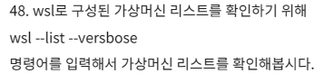

## github 


스타팅 파일 github 링크 (startingFile)

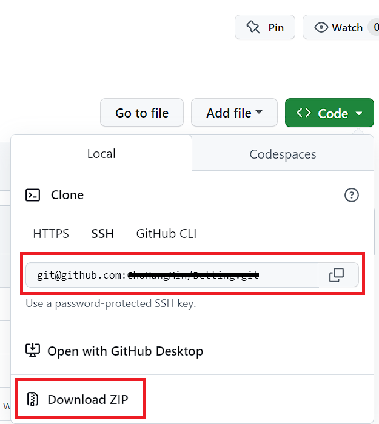

위의 gitgub 링크에서 기본 디렉토리 파일을 설치한다. 
github가 친숙하다면 linux 환경에서 git clone을 이용하여 다운로드하고, 그렇지 않다면 ZIP을 받아서 직접 Window GUI를 이용하여 Linux에 압축을 풀어 놓는다. 

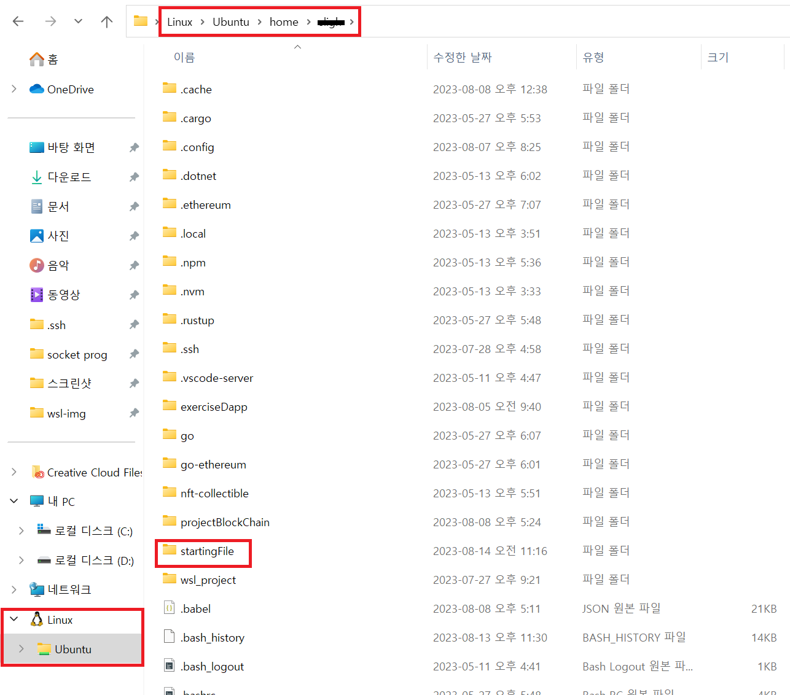

## 의존성 설치 

튜토리얼를 진행하기에 앞서 로컬 컴퓨터에 전역적으로 혹은, 해당 디렉토리에서 필요한 패키지들을 설치하는 과정이다. 

### 1-1

ubuntu terminal을 연다. 

cd startingFile을 통해 디렉토리에 접근한다. (압축을 통해 풀었다면 startingFile (압축을 푼 파일) 안에 startingFile (압축 안에 있었던 본 파일)이 하나 더 있을 수 있으므로 본 파일만 있을 수 있게 설정한다.)
```bash
    cd ~
    cd startingFile
```
(간혹 디렉토리 파일 경로가 다르다면, ls 라는 명령어를 통해 디렉토리의 리스트를 확인할 수 있고, cd 라는 명령어를 통해 디렉토리 구조를 파악할 수 있다. cd .. (상위 디렉토리로 이동) cd . (현재 디렉토리) cd ~ (root 디렉토리로 이동))

### 1-2 

ubuntu terminal에서 해당 디렉토리에 접근하였으면 
```bash
    code . 
```
를 통해서 vscode로 열어준다. 만약 에러가 뜨며 열리지 않는다면, ubuntu terminal을 재실행해준다. 

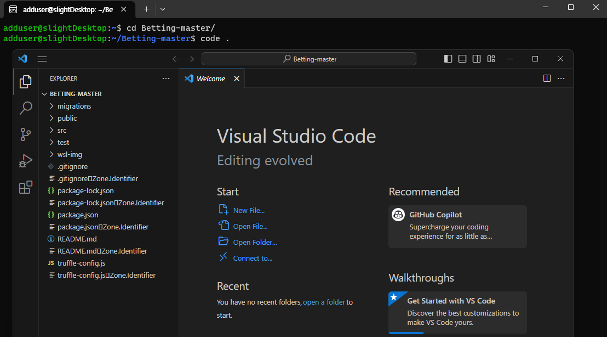

이미지 속 터미널에서 디렉터리 명이 다를 수 있으므로 주의.  Betting-master -> startingFile

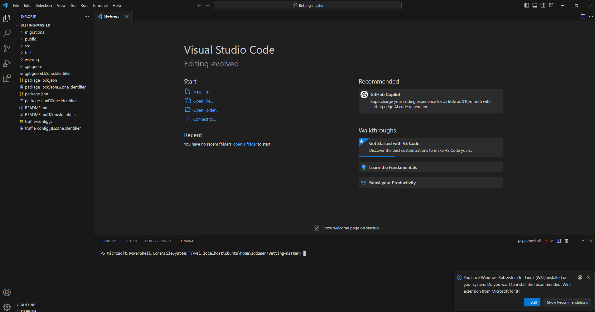

이후 상단의 터미널 창을 열어주면 해당 이미지와 같이 뜰 것이다. 

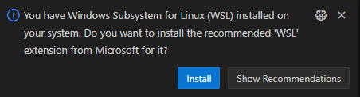

를 통해 vscode 내에서 wsl를 설치해준다면 

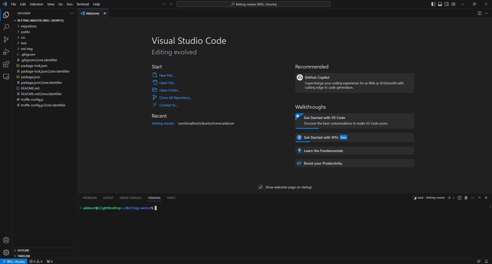

터미널이 우분투 환경으로 변경될 것이다. 이제부터 해당 콘솔에 명령어를 하나씩 입력하면 된다.

### 1-
```bash
    sudo apt-get update
    sudo apt-get upgrade
    sudo apt-get install curl
    sudo apt-get install build-essential libssl-dev
    curl -o- https://raw.githubusercontent.com/nvm-sh/nvm/master/install.sh | bash
    source ~/.bashrc 
```
시스템의 패키지 목록을 최신으로 업데이트 하고 필요한 nvm 및 패키지를 설치하는 코드이다. 맨 마지막 코드를 통해 변경사항을 저장한다. 

    sudo apt-get install build-essential libssl-dev 
    
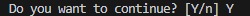

해당 명령어를 실행한다면 위의 이미지 처럼 Y/n 을 입력하라는 창이 뜰 것이다. 이때 Y를 입력하면 정상적으로 설치가 진행된다.

### 1-
```bash
    nvm install 14
    nvm use 14
    nvm install node
    npm install -g truffle
```
node는 애플리케이션 구축을 목적으로 설계된 Javascript 환경이다. 
nvm과 npm은 node의 필요한 패키지들을 간편하게 설치하고 관리할 수 있는 CLI 도구이다. 
truffle 이더리움 기반의 스마트 컨트랙트를 개발하고 배포할 수있도록 도와주는 프레임 워크이다.

    truffle version 

이라는 명령어를 통해 truffle이 잘 설치 되었는지 확인해 볼 수 있다. 

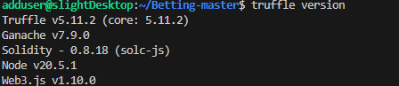

## metamask 


메타마스크는 이더리움 개인지갑을 편리하고 안전하게 관리 할 수 있는 구글 확장 프로그램이다. 
아래의 링크를 참조하여 아이디를 만들고 로그인을 한다. 

https://log-laboratory.tistory.com/355


## ganache


가나슈는 PC에 설치 가능한 블록체인 테스트넷 환경이다. 이를 통해 복잡한 절차 없이 블록체인을 테스트넷에 배포해보고 
실습해볼 수 있다. 

https://trufflesuite.com/ganache/

###  1-1. 가나슈를 실행하여 workspace에 들어간다.
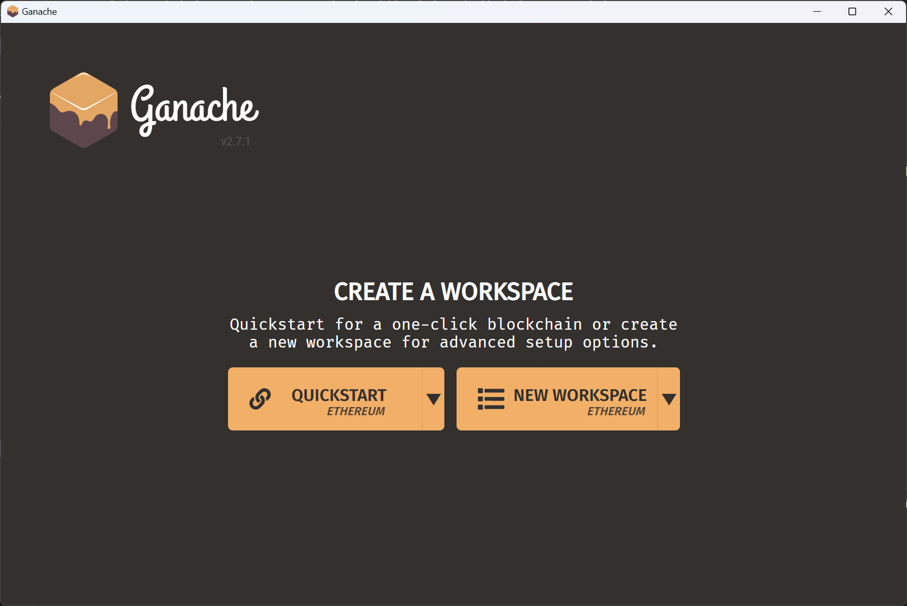
### 1-2. server에서 hostname을 WSL버전으로 바꿔준다. 
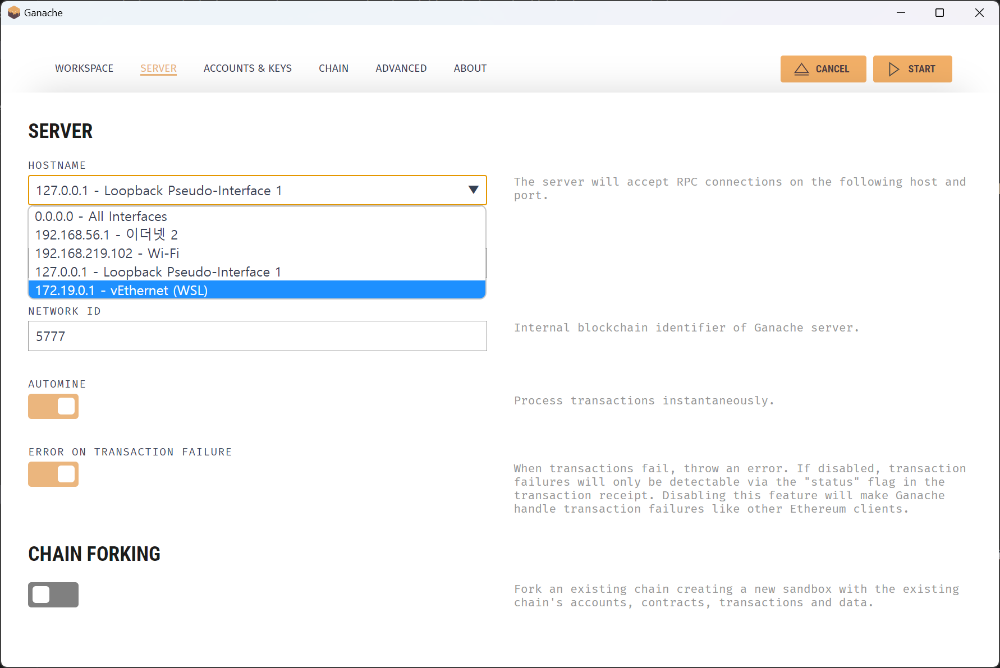
### 1-3. RFC SERVER의 IP주소를 복사 해둔다.
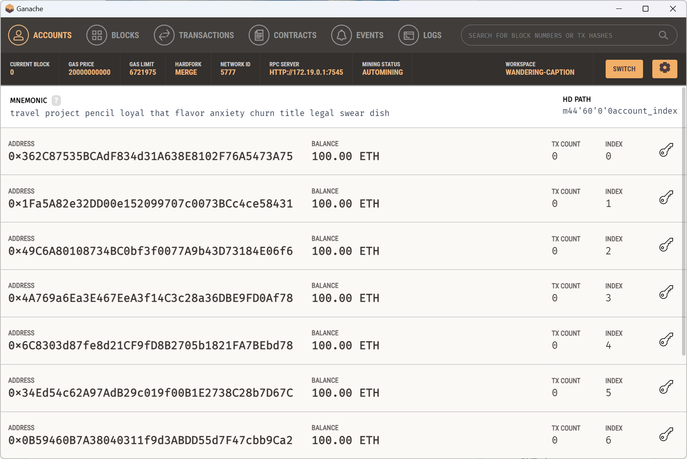
가나슈 설명란, 10개의 지갑이 보인다. 
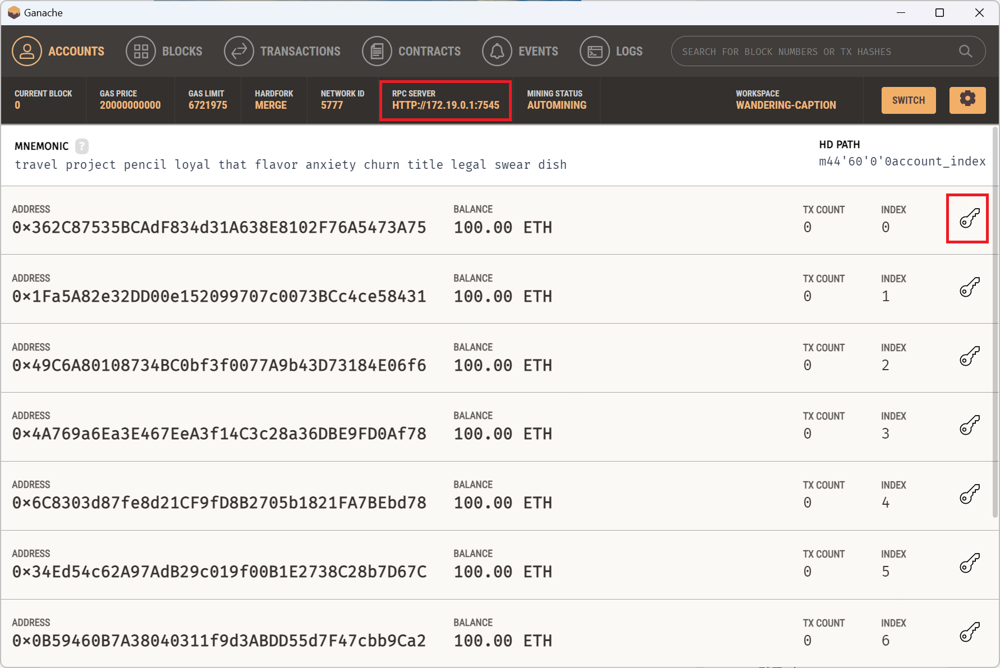
### 1-4. NETWORK 추가를 누른뒤, 네트워크 수동추가를 눌러준다.
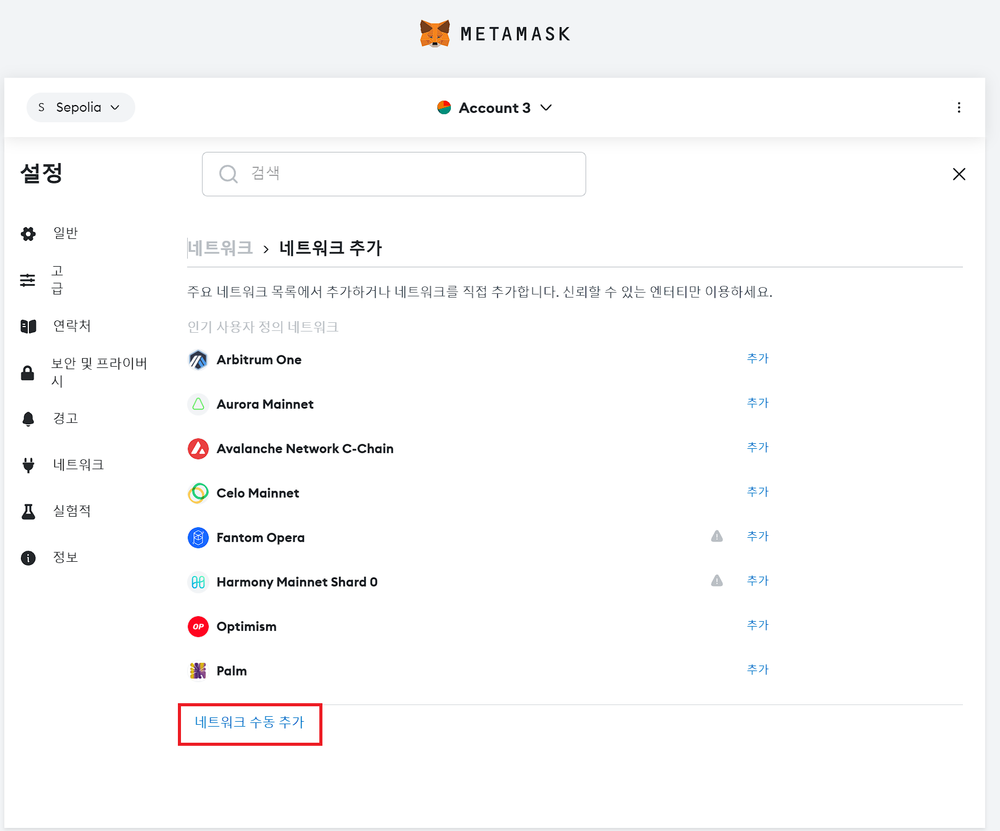
### 1-5. 네트워크 이름을 설정하고, 아까 복사했던 주소를 RFC SERVER란에 붙여넣어준다. 나머지는 위의 이미지와 동일하게 작성해준뒤 저장을 누른다.  
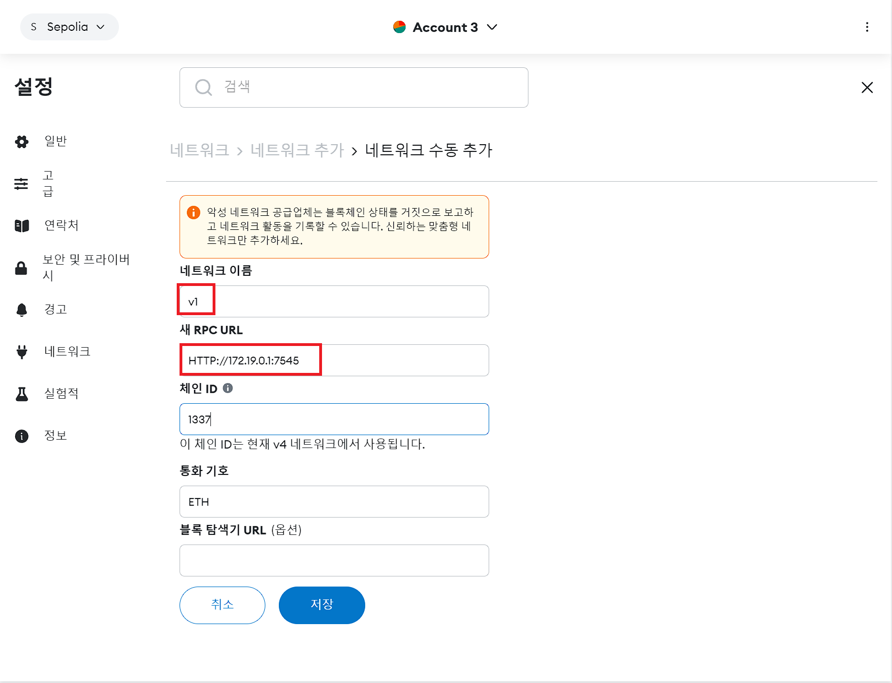
### 1-6. 가나슈 설정 창의 첫번째 지갑의 열쇠 모양을 클릭하고 개인키를 복사해준다.   

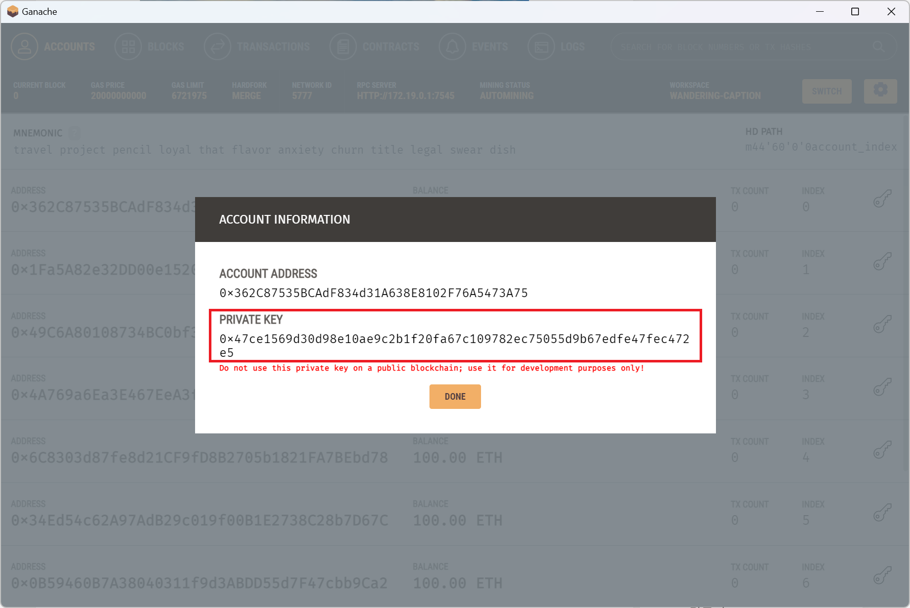
### 1-7. 위의 ACCOUNT를 누른 뒤, 계정 가져오기를 클릭한다. 
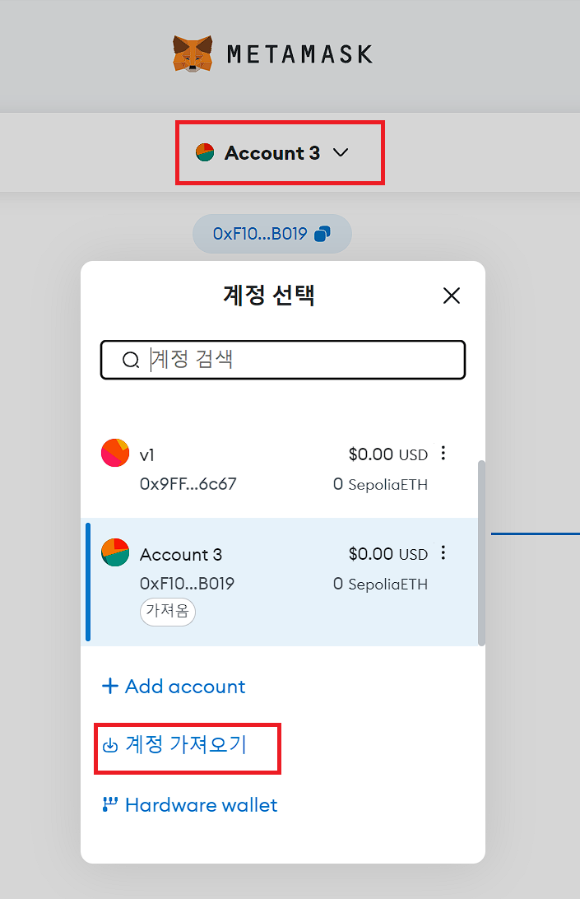
### 1-8. 빈 칸란에 아까 복사해둔 개인키를 붙여넣고 가져오기를 클릭한다.
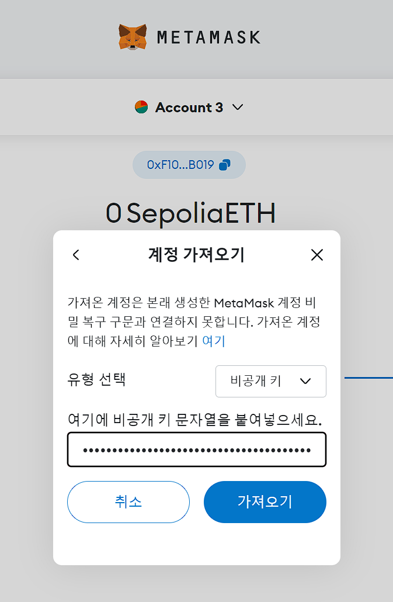
### 1-9. 아까 설정했던 네트워크 및 계정을 설정하면 가나슈의 첫번째 계정 정보를 메타마스크에서 확인 할 수 있다. 
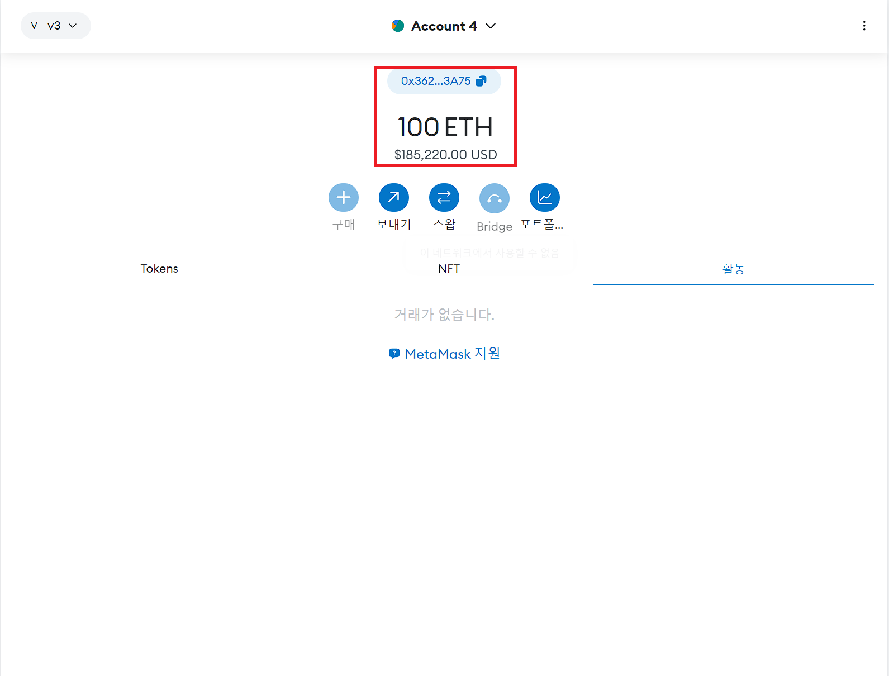
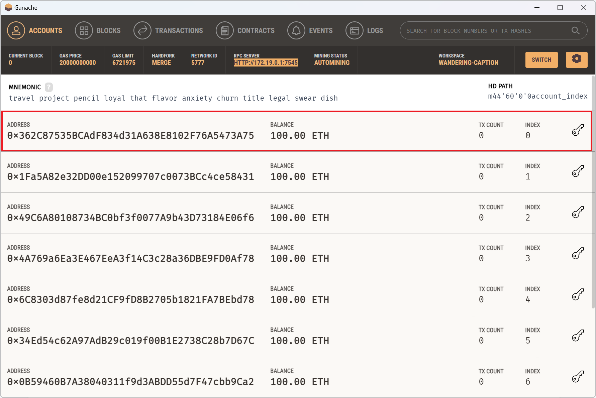
 

## truffle-config.js 설정 

truffle-config.js는 truffle이라는 프레임워크를 사용할 경우 설정해야하는 파일이다. 
truffle을 통해 스마트 컨트랙트를 컴파일하고, 사용하는 테스트넷에 배포할 수 있다. 
각각의 필요한 세부사항을 살펴보겠다. 
```js
    module.exports = {
        networks: {},
        contracts_directory: ,
        contracts_build_directory:,
        migrations_directory:,
        tests_directory:,
        compilers: {}
    }
```
해당 구조가 기본 코드의 틀이라고 할 수 있다. 
networks 파트 에서 이전의 가나슈 설정 파트에서 사용했던 테스트 넷 RFC 주소를 참고하여 작성합니다. 
```js
    networks: {
        development: {
        host: "XXX.XXX.XXX.XXX",     // Ganache 앱을 실행 중인 로컬 호스트
        port: 7545,            // Ganache 앱에서 사용하는 포트 번호 (기본값은 7545)
        network_id: "*",        // 모든 네트워크에 대해 설정
        },
    },
```   
XXX.XXX.XXX.XXX:7545 이라는 테스트 넷에 접속하여, 테스트 넷의 네트워크 id와 상관없이 연결을 하겠다는 코드입니다. 
```js
    contracts_directory: './src/contracts/',
    contracts_build_directory: './src/truffle_abis/',
    migrations_directory: './migrations/',
    tests_directory: './test/',
```
해당 디렉토리 중 컨트랙트가 보관되어 있는 디렉토리, 컴파일 시 생성되는 파일에 대한 디렉토리, migrations 설정이 들어있는 디렉토리, 그리고 test를 사용할 때 필요한 파일을 담은 디렉토리의 위치를 설정해주는 코드입니다. 
```js
    compilers: {
        solc: {
        version: '0.8.18',
        optimizer: {
            enabled: true,
            runs: 200
            },
        }
    }
```
해당 코드는 solidity언어를 compile할 compiler의 정보를 설정하는 코드입니다. 
version은 compiler가 사용할 solidiy의 버전을
optimizer의 enable은 컴파일러 실행 속도 및 가스 비용을 줄일 수 있는 기능입니다. 
run은 해당 기능이 활성화 되었을 경우, 계약이 자주 호출된다면 높은 값을, 그렇지 않다면 낮은 값을 설정하는게 
유리합니다. 

아래의 코드는 truffle-config.js 파일의 코드 전체입니다. 
```js
    module.exports = {
        networks: {
            development: {
                host: "192.168.96.1",     
                port: 7545,            
                network_id: "*",        
            },
        },
        contracts_directory: './src/contracts/',
        contracts_build_directory: './src/truffle_abis/',
        migrations_directory: './migrations/',
        tests_directory: './test/',
        compilers: {
            solc: {
                version: '0.8.18',
                optimizer: {
                    enabled: true,
                    runs: 200
                },
            }
        }
    }
```
만일 가나슈의 워크 스페이스를 계속 생성하고 실행하는 과정에서 테스트 넷 RFC server 주소가 바뀐다면 
network의 host의 값을 계속해서 변경해야 제대로 deploy가 될 수 있습니다. 

