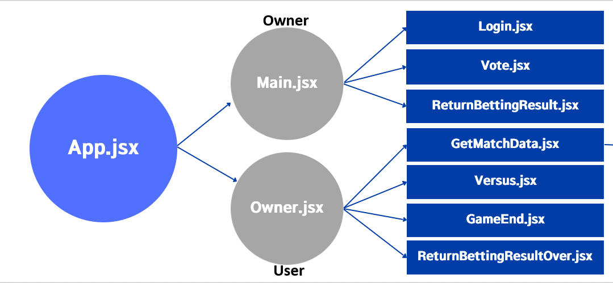
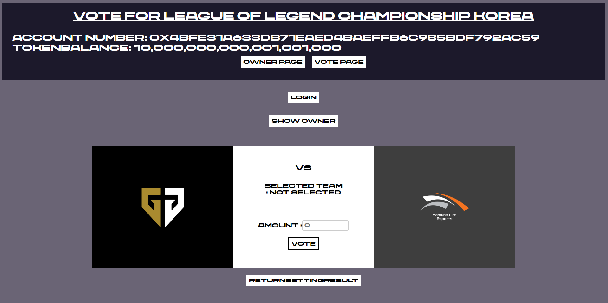
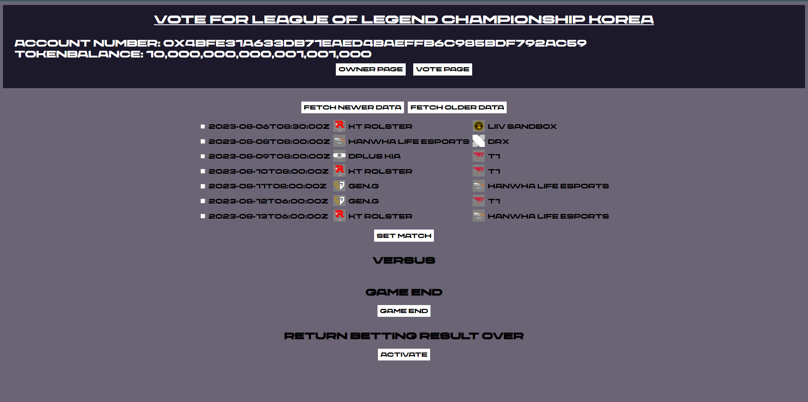

# React 연동
solidity code를 완성했다면, 이제는 사용자가 접근할 유저 인터페이스를 react를 이용해 구성할 차례이다.

이 페이지는 간단히 Metamask와 연동하고, 작성한 solidity code의 정보에 접근하는 과정에 대해 작성해 둔 글이다.

<br/>

프로젝트를 진행하게 된다면 이 페이지만 보는 것이 아니라 더 나아가서 심화적인 react 공부가 필요할 것이다.

이 프로젝트의 구조는 이러하다.

이 외에, 화면 상단의 Navbar를 만들어 ```account```, ```balance```를 확인할 수 있게 하였다.

# # 1.  Metamask 연동
우리는 Ethereum 블록체인과 상호작용하기 위해 web3 라이브러리를 사용할 것이다. 

web3 라이브러리를 불러오고, Metamask와 연동하는 과정이 필요하다.

<br/>
코드의 내용은 다음과 같다.

```js
import Web3 from 'web3';

async function loadWeb3() {
    try {
      if (window.ethereum) {
        window.web3 = new Web3(window.ethereum);
        await window.ethereum.enable();
      } else if (window.web3) {
        window.web3 = new Web3(window.web3.currentProvider);
      } else {
        window.alert('No ethereum browser detected!');
      }
    } catch (error) {
      window.alert(error);
    }
  }
  ```
1. ```window.ethereum```이 존재하는 경우 즉, web3 인터페이스가 지원되는 경우 ```Web3``` 객체를 생성하고, ```enable``` 함수를 호출해 사용자에게 계정 접근 권한을 요청한다.
(이 때 Metamask를 통해 사용자 승인을 요구하는 팝업이 뜨면서 사용자가 승인하게 되면 해당 계정을 사용하여 Ethereum 네트워크와 상호작용 할 수 있다.)

2. ```window.web3``` 객체가 존재하는 경우에는 이미 승인이 완료된 상황이므로 ```currentProvider```을 이용해서 현재 사용자로 web3를 생성한다. 

3. 사용자가 승인하지 않는다면 이더리움 브라우저가 감지되지 않았음을 사용자에게 알린다.
 (메타마스크가 설치되지 않았거나 Web3를 지원하지 않는 브라우저를 사용하면 자동으로 이더리움 브라우저가 감지되지 않았음을 알리게 된다.)<br>
 
<해결방법>
- ```npm install web3```를 하지 않은 경우, 오류가 발생한다. 필히 web3를 다운했는지 확인하자.

- Metamask의 서버를 Ganache주소로 맞추어야한다. 이에 대한 과정은 [Ganache](https://github.com/Minkun00/Betting#ganache)과정을 다시 확인하길 바란다.


# # 2. contract(계약) 정보 받아오기
Metamask의 연동이 되었다면, 이제는 우리가 작성한 solidity code를 이용해야 할 시간이다.

Contract의 정보를 받아와서 함수나 변수에 접근하는 과정을 진행해야한다.

<br/>
코드의 내용은 다음과 같다.

```js
import Contracts from './truffle_abis/Vote.json';

async function loadContracts() {
    try {
      const web3 = new Web3(window.ethereum);
      const accounts = await web3.eth.getAccounts();
      const account = accounts[0];
      setAccount(account);

      const networkId = await web3.eth.net.getId();
      const contractData = Contracts.networks[networkId];

      if (contractData) {
        const contract = new web3.eth.Contract(Contracts.abi, contractData.address);
        setContract(contract);
      } else {
        window.alert(
          'Vote contract not deployed to detect network! Please check your metamask network'
        );
      }
    } catch (error) {
      console.log(error);
    }
  }
```
1. 먼저, contract의 정보나 만들어놓은 함수들에 접근하기 위해 스마트 컨트랙트 ABI 가져와야 한다.
<br>   
따라서 truffle_abis 폴더에 있는 json file을 import 해주어야 한다.
<br><br>
여기서는 Vote.sol이 SetTeam.sol과 Token.sol 코드를 상속받고 있기 때문에 Vote.sol을 통해 만들어진 Vote.json 파일만 가져오도록 하겠다.


2. 다시 한 번 Web3 객체를 생성하고 getAccounts 함수를 통해 Metamask에 등록되어있는 계정의 목록을 받아온다.
<br><br>
이 때 Ganache를 이용해 10개의 계정을 동시에 등록할 수 있다.

3. web3.eth.net.getId 함수를 통해 Ganache 네트워크 id인 5777을 받아올 수 있다.
<br><br>
[Vote.json](https://github.com/Minkun00/Betting/blob/master/src/truffle_abis/Vote.json) 파일을 확인해보면, 


```json
"networks": {
    "5777": {
      "events": {},
      "links": {},
      "address": "0xD30E2173C4e6A52A3C02A332Dfc6b4b8Ea3e1980",
      "transactionHash": "0xb67b6e64df5abc80c069618907db0c460020de9875006afec4f508737509c7a3"
    }
  },
```

&nbsp;&nbsp;&nbsp;&nbsp;&nbsp;&nbsp;&nbsp;&nbsp;Contract의 networks가 5777인 스마트 컨트랙트의 네트워크 정보를 가져온다.

4. contractData가 존재한다면, Contract 객체를 만들어주고, contract 자체를 setContract 함수를 통해 저장해주면 된다.

5. 오류 상황이 발생했다면 적절한 처리를 통해 사용자에게 원인을 알린다.


# # 3. contract 함수 사용하기
받아온 Contract 정보를 이용하여 solidity 코드에서 정의한 함수를 호출하여 웹에서 실행한다.

contract의 함수를 호출하는 데에는 두 가지 방법이 존재한다.

공통적으로는 
```js
const <returnValue> = await contract.methods.<methodName>(variable).~
```
형식이다.

<주의할 점> 
- ```await```를 사용해야 확실하게 contract의 function을 사용할 수 있다. 그래서, 비동기함수 형식인 ```async```구문을 사용해서 선언해야한다.
- solidity에서 선언한 함수가 ```require```문 또는 ```modifier```등을 통해서 제한하는 경우가 있다. 이런 경우 조건에 맞지 않는 경우 실행할 때, 오류처리를 해주어야지 문제가 생기지 않는다. 또한, ```catch(error)```후 ```console.log(error)```를 사용하면 왜 에러가 났는지 확인할 수 있다. Error Message 후반부에 왜 문제가 생겼는지 알 수 있으니, 상당히 중요하다.

### 1. call 함수로 Contract 함수 호출 ([/src/App.jsx](https://github.com/Minkun00/Betting/blob/master/src/App.jsx) : Line 28-29 참조))
```js
const userBalance = await contract.methods.balanceOf(account).call();
const ownerAddress = await contract.methods.showOwner(account).call();
```
위와 같이 call 함수로 호출할 때에는 블록체인의 상태를 변경하지 않고 '읽기'작업만 이루어지는 함수를 호출하는 방법이다.

호출이 빠르고 contract의 상태 변경이 없어 가스 비용이 낮은 호출 방법이다.

### 2. send 함수로 Contract 함수 호출 ([/src/user/function/Mainfunction.jsx](https://github.com/Minkun00/Betting/blob/master/src/user/function/Mainfunction.jsx) : Line 46 참조))

아래는 contract상의 vote함수를 호출하는 vote_함수를 Mainfunction.jsx에 구현한 코드이다.
```js
src/user/function/Mainfunction.jsx

async function vote_(vote, teamName, amount, account) {
    console.log("vote activate")
    try {
        await vote.methods.vote(teamName, amount).send({ from: account })
        console.log(`user have voted for ${teamName}, ${amount}`)
    } catch(error) {
        console.log(error)
        window.alert("vote error")
    }
}
```
vote contract의 method 중 vote 함수를 teamName과 amount 값을 이용해 실행하는 데, 이 때 send 함수를 사용하여 트랜잭션을 호출하게 된다.

send 함수로 호출할 때에는 트랜잭션을 생성하여 블록체인 contract의 상태 변경을 유발해 가스 비용이 높은 방법이다.

따라서 상황을 잘 구분하여 두 가지 방법을 적절하게 활용하는 것이 중요하다.

이제 웹페이지에서 버튼을 눌렀을 때 만들어놓은 vote_함수를 사용할 수 있도록 설정해보겠다.

```js
src/user/src/Vote.jsx

import { vote_,balanceOf_ } from "../function/Mainfunction"

function Vote({ contract, account, team1Name, team1URL, team2Name, team2URL}) {

    const handleVote = async () => {
        try {
            await vote_(contract, selectedTeamName, amount, account);
            console.log(selectedTeamName);
            console.log(amount);
        } catch (error) {
            console.log(error);
            window.alert("vote Error!");
        }
        balanceOf_(contract, account)
        }
    return(
        <React.Fragment>{
            <button type='submit' className='vote-button' onClick={handleVote}>VOTE</button>
        }</React.Fragment>
    );
}
```

1. 먼저 /src/user/function/Mainfunction.jsx 파일에서 vote_ 함수를 import 해서 사용할 수 있도록 한다.
 
2. VOTE 버튼이 눌렸을 때 실행될 함수인 handleVote를 설정해주는데 이 때, /src/user/function/Mainfunction.jsx의 vote_함수를 실행하도록 설정해주었다.
   
3. ```<button>``` 태그의 onClick 속성을 handleVote 함수로 설정하여 클릭했을 때 handleVote 함수가 실행되어 vote의 단계가 진행되도록 설정하면 된다.


# # 4. react의 useState 사용하기
React에서 상태관리를 위해 useState를 사용한다.

함수형 컴포넌트 내부에서 다양한 상태의 관리를 useState를 통해 할 수 있다.

코드 내용은 다음과 같다.

```js
import React, { useState, useEffect } from 'react';
function App() {
  const [account, setAccount] = useState('0x0');
}
```
1. react의 useState 훅을 사용할 수 있게 import 해준다.

2. useState를 사용하여 account 상태와 이를 업데이트하는 setAccount 함수를 생성한다(이 때 account의 초기값은 useState 함수의 parameter인 '0x0'으로 설정된다).

3. 이 state를 변경시키고 싶다면 setAccount 함수를 호출하면 된다.
```js
// src/App.jsx : Line 22.
setAccount(account);
```

# # 5. react의 localStorage 사용하기
웹 애플리케이션 전체에서 데이터를 유지하려면 웹 브라우저에서 제공하는 localStorage를 사용할 수 있다. 

localStorage는 브라우저 저장소에 데이터를 영구적으로 저장하므로, 사용자 경험 개선이나 데이터 유지가 필요한 경우에 사용한다.

따라서 localStorage를 사용하면 브라우저를 닫았다가 다시 열어도 데이터가 유지되도록 할 수 있다.

코드 내용을 확인해보자.

```js
// src/owner/function/LocalStorageService.jsx

export const saveDataToLocal = (key, data) => {
    localStorage.setItem(key, JSON.stringify(data));
};
  
export const getDataFromLocal = (key) => {
    const data = localStorage.getItem(key);
    return data ? JSON.parse(data) : null;
};
```

1. 데이터를 저장할 때에는 localStorage.setItem 함수를 이용하여 key와 값을 localStorage에 저장할 수 있다.
   
2. 데이터를 받아올 때에는 localStorage.getItem 함수를 이용하여 해당 key의 값을 받아올 수 있다.

위 코드에서는 key에 대한 값을 json형식으로 저장하고, 이를 다시 원래 데이터 형태로 받아오는 방식으로 저장하였다.

localStorage를 사용할 때 주의할 점은 도메인별로 용량 제한이 있기에 많은 데이터를 저장할 수 없다는 점이다.


<br/><br/><br/>
## 최종 코드
이제 위의 단계들을 통해 스마트 컨트랙트를 작성하고 Metamask와 연동하여 React 앱과 상호작용할 준비가 되었다.

실제로 프로젝트를 개발하는 과정에서는 코드를 조금씩 수정하고 보완하며 원하는 기능을 추가해보면서 더욱 실질적인 경험을 쌓아보시기 바란다.

최종적인 UI 설계는 Github에서 확인하기를 바란다. 보고 싶은 코드의 파일 이름을 클릭하면 확인할 수 있다.


[App.jsx](https://github.com/Minkun00/Betting/blob/master/src/App.jsx)


## 최종 결과물


**Vote Page**


**Owner Page**