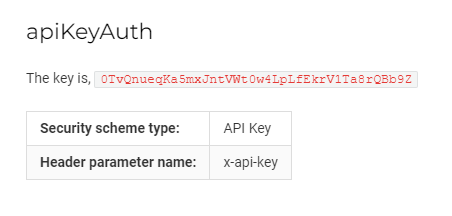
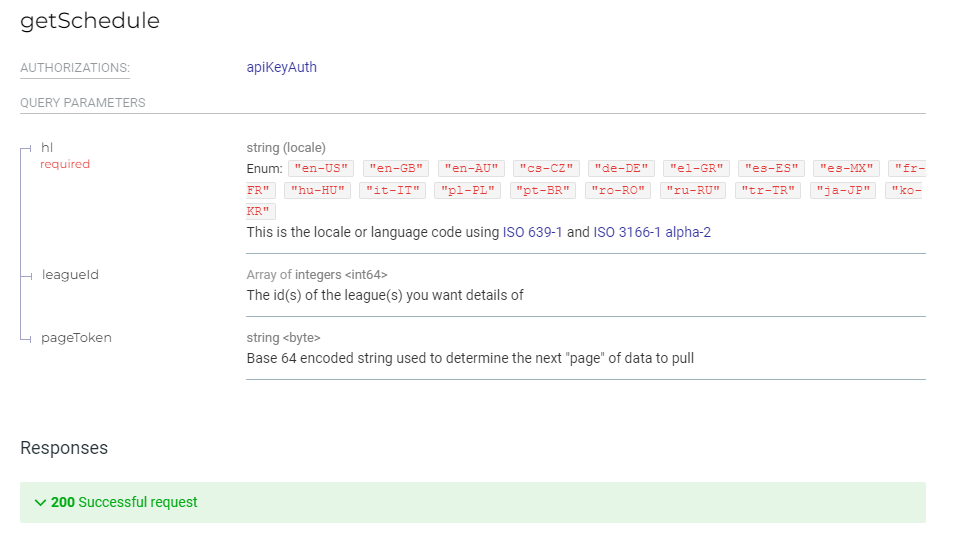
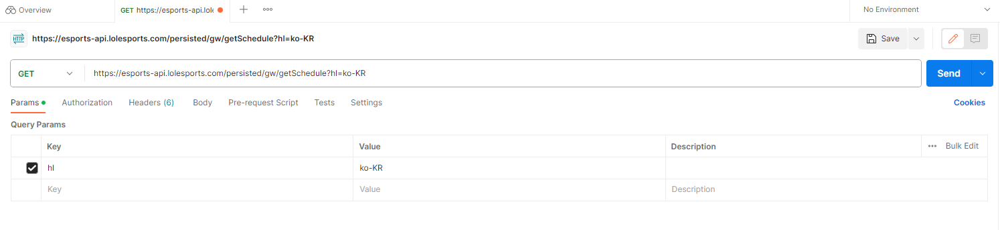
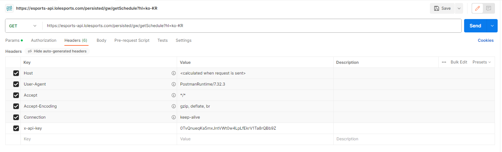

## GET API
지금까지 만든 프로그램을 실행하기 위해서는, 대회 데이터를 받아와야 한다. 이 데이터는 크롤링 또는 API라는 선택지가 있다. 

처음에Python - Selenium 크롤링을 만들었지만, React상에서 Python 코드를 연결하는 것은 상당히 복잡하기에 API를 이용하는 방법을 찾게 되었다.

먼저, League Of Legeng와 관련된 API를 얻는 곳은 [developer.riotgames](https://developer.riotgames.com/apis)에 있다. 하지만, 여기는 게임에 관련된 API만 있고, 대회와 관련된 API는 없었다. 그래서 찾은 사이트가 [여기](https://vickz84259.github.io/lolesports-api-docs/)다. 공식적인 API를 제공하는 것은 아니지만, 여기말고는 못찾았다.

혹시라도 LOL과 관련된 프로그램을 만들고 싶은 사람은 [lol discord](https://discord.gg/riotgamesdevrel)에서 찾아보기를 바란다.

그리고 이 내용을 시작하기 전에, API를 사용하고 싶으면 
```bash
npm install axios
```
를 실행하여 ```axios```를 다운받아야 한다. python으로 치면 ```requests```모듈이다.


* 이 모든 과정은 [GetMatchData.jsx](https://github.com/Minkun00/Betting/blob/master/src/owner/src/GetMatchData.jsx)에 있다.


## HOW TO USE
우리가 사용할 것은 https://esports-api.lolesports.com/persisted/gw/getSchedule 이다. 이에 대한 정보는 [여기](https://vickz84259.github.io/lolesports-api-docs/#operation/getSchedule)에서 확인 가능하다.




사이트에서 확인할 수 있는 api key와, getSchedule의 형식이다. 

## TEST
API를 코드로 불러오기 전, Test를 통해 어떤 구조를 지니고 있는지 확인하는 것도 필요하다. 테스트를 할 수 있는 곳은 [postman](https://www.postman.com/)을 사용했다. workspace에 들어가서 Overview 옆에 tab을 늘리면 API test를 하기 위한 준비를 할 수 있다.




그러면, return하는 json파일의 형식은 어떻게 되어있을까?
```json
{
    "data": {
        "schedule": {
            "pages": {
                "older": "b2xkZXI6OjExMDUzNTYwOTQxNzAyOTcxNg==",
                "newer": "bmV3ZXI6OjExMDQxNjk5MDE5Njg5MDAwMQ=="
            },
            "events": [
                {
                    "startTime": "2023-08-14T18:00:00Z",
                    "state": "completed",
                    "type": "match",
                    "blockName": "플레이-인 그룹 스테이지",
                    "league": {
                        "name": "EMEA Masters",
                        "slug": "emea_masters"
                    },
                    "match": {
                        "id": "110535609417029716",
                        "flags": [],
                        "teams": [
                            ... // event 배열 안 반복적인 형식
```
events안에 match에 대한 내용이 반복적으로 배열의 형식으로 되어있는 것을 확인할 수 있다.

여기서 중요한 내용은 
```json
"pages": {
    "older": "b2xkZXI6OjExMDUzNTYwOTQxNzAyOTcxNg==",
    "newer": "bmV3ZXI6OjExMDQxNjk5MDE5Njg5MDAwMQ=="
},
```
부분이다. 한번 request를 보내면 한 주에 대한 데이터만 받기 때문에, 그 후, 또는 그 전의 데이터는 older또는 newer의 값을 사용해야 한다. 

그러면, React에서 코드로 이 데이터를 필요한 상황에 따라 받아올 수 있게 하자.


## In React
이 내용들을 Code로 옮기면 아래와 같다.

```jsx
const handleFetchData = (token) => {
    setIsLoading(true);

    const apiUrl = 'https://esports-api.lolesports.com/persisted/gw/getSchedule';
    const headers = {
      'x-api-key': '0TvQnueqKa5mxJntVWt0w4LpLfEkrV1Ta8rQBb9Z'
    };

    const params = {
      hl: 'ko-KR',
      ...(token && { pageToken: token })
    };

    axios.get(apiUrl, { headers, params })
      .then(response => {
        setLocalData(response.data);
        saveDataToLocal('matchData', response.data);
      })
      .catch(error => {
        console.error('Error fetching data:', error);
      })
      .finally(() => {
        setIsLoading(false);
      });
  };
```
기본적인 ```apiUrl```, headers에 들어갈 ```x-api-key```를 설정한다. 그 후, params에 들어갈 ```hl```값과 ```pageToken```값을 고려하자. 만약, 이 함수가 처음 실행될 경우, pageToken의 값을 아는 것이 없으니, 없을 경우 무시해주는 코드로 작성하고, 한번 실행되고 나서 ```pageToken```의 값을 얻게 되면 그에 따른 시간대의 match정보를 받아오자.
 

api관련된 값들은 다시 실행해도 남아있게끔 local로 저장해두었다.

얻어온 데이터를 바탕으로 lck와 관련된 데이터만 추출하고, 그 내용을 화면에 띄우면 끝난다.

자세한 코드는 [GetMatchData.jsx](https://github.com/Minkun00/Betting/blob/master/src/owner/src/GetMatchData.jsx)에서 확인하면 된다.

## 실행화면


FetchNewerData부터 표 형식으로 되어있는 정보까지가 GetMatchData.jsx에서 실행되는 내용이다. 위의 버튼 두 개를 누르면 누른 정보에 따라 현재 json파일 기준으로 과거, 미래의 값도 가져올 수 있게 했다.
